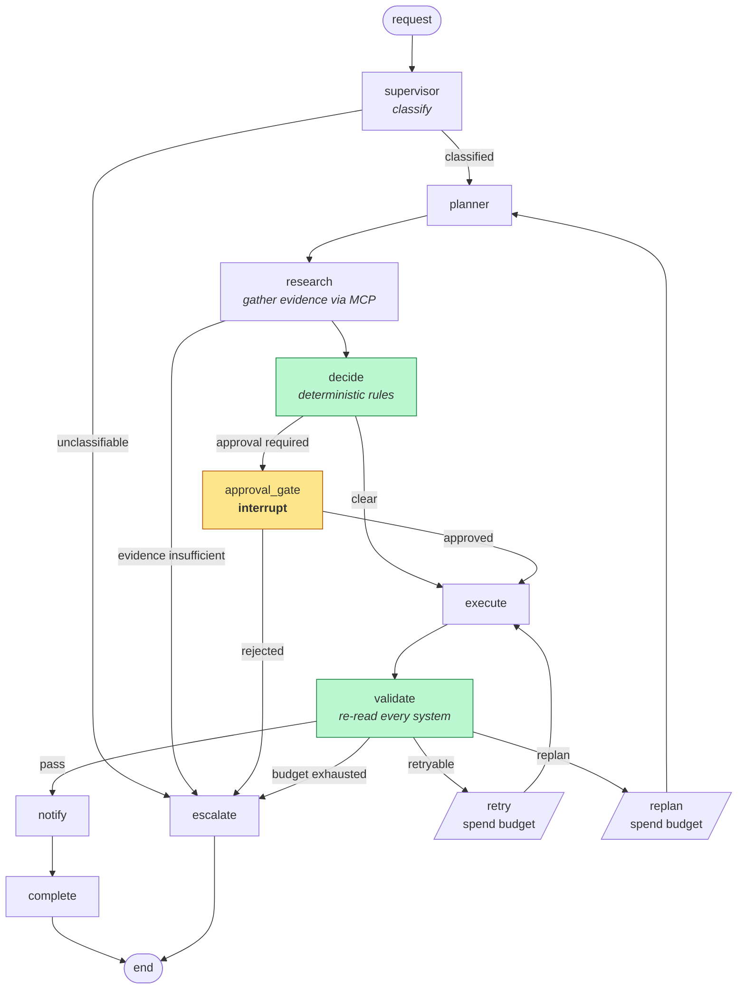
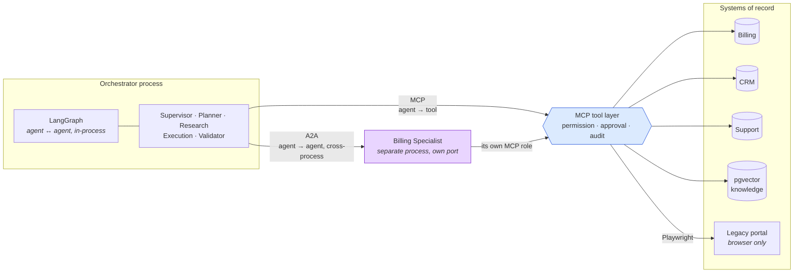
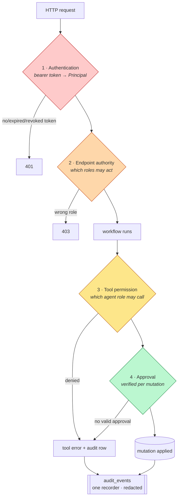

# Architecture overview

The delivered system, as of Phase 14. Where a design choice had a real
alternative, the reasoning lives in an [ADR](../decisions/) and is linked rather
than repeated.

---

## What the system is

An orchestrator for B2B SaaS customer operations. It takes a natural-language
request — *"upgrade Acme to enterprise"* — and carries it through to a verified
change across three systems of record: billing, CRM, and a legacy provisioning
portal that has no API.

One workflow ships end to end (Subscription Upgrade, decision D3). Depth over
breadth: three shallow workflows would be variations on one graph.

## The shape of a run



Green nodes decide nothing with a model: eligibility, pricing and the approval
requirement come from `domain/rules` and `domain/policies`. The amber node
**interrupts** — the run stops, the process may exit, and a human decides hours
later. That is what the PostgreSQL checkpointer is for.

`retry` and `replan` are graph-owned bookkeeping nodes, not agent behaviour.
They spend a budget *before* repeating work, so termination does not depend on a
node remembering to increment a counter.

## Three protocols, three distinct jobs

The most common confusion about this system is that MCP and A2A overlap. They do
not.



- **LangGraph** orchestrates agents inside one process. It is not a protocol for
  reaching anything external.
- **MCP** is the only path from an agent to a tool. Permission, approval and
  audit happen there, so a tool cannot forget a check it never performs.
- **A2A** is agent-to-agent across a process boundary. The Billing Specialist
  runs on its own port, holds its own read-only MCP role, and the orchestrator
  degrades gracefully when it is absent ([ADR-006](../decisions/ADR-006-a2a-specialist-boundary.md)).

Note the specialist's arrow back into the MCP layer: being a separate process
does not put it outside the tool boundary, it puts it on the far side of one.

## Security boundaries

Four independent gates. The point is that no single one is trusted.



Gates 1 and 2 are Phase 13; 3 is the Phase 4 permission matrix; 4 is D9's
third layer, which the MCP tool verifies **independently** — a mutating tool
called directly, bypassing the graph entirely, still refuses. That is tested by
doing exactly that.

**Identity has one source.** The approval endpoint used to take `actor_user_id`
in the request body; it no longer does, and the schema forbids extras
([ADR-007](../decisions/ADR-007-authentication-model.md)). A perfect audit trail
of a forged identity is worse than none, because it looks like evidence.

## How a trace is reconstructed

Three layers write independently under one `execution_id`. That they agree is
itself informative.

```mermaid
flowchart LR
    subgraph writers["Written during the run"]
        STEP[workflow_steps<br/><i>graph, per node visit</i>]
        TC[tool_calls<br/><i>MCP layer</i>]
        AE[audit_events<br/><i>19 event types</i>]
    end

    REC[[record_event<br/>single path · redaction]] --> AE

    STEP & TC & AE --> ASM[build_timeline<br/><i>pure, ordered</i>]
    ASM --> EP[GET /workflows/&#123;execution_id&#125;]
    ASM --> COV[event coverage<br/><i>what never happened</i>]

    style REC fill:#dbeafe,stroke:#1d4ed8
    style ASM fill:#bbf7d0,stroke:#15803d
```



Ordering is `(occurred_at, id)`, not `occurred_at` alone: PostgreSQL's `now()`
is *transaction* time, so three events written in one savepoint share a
timestamp. The monotonic id breaks the tie in insertion order — without it a
tool's completion can sort before the call that produced it.

**Never chain-of-thought.** Redaction runs inside the recorder *and* again at
the endpoint, because rows may predate the recorder and the endpoint is the
boundary that actually discloses.

---

## Where the LLM is, and is not

| The model does | The model never does |
|---|---|
| Classify a request | Decide eligibility |
| Draft a plan | Compute a price |
| Draft customer prose | Judge whether its own evidence was sufficient |
| Explain a blocker | Authorise a mutation |

Every consequential decision is Python reading structured facts, which is what
makes the Validator able to recompute an outcome from evidence alone and
disagree with the agent that produced it.

## Validation

The Validator re-reads **from the systems of record**, never from what execute
returned, and reads the legacy portal *through the portal* rather than querying
the entitlements table — a validator that checks its own side of an integration
proves nothing. A billing `200` is not business success (D8).

## Evaluation

`agent-forge@v0.1.0` scores the orchestrator; it is a **dev dependency** and no
production module imports it (D10). CustOps supplies the trace adapter, the
adversarial datasets, and the metrics a generic harness cannot compute —
planning accuracy, retrieval precision/recall, and whether the Validator caught
an *injected* divergence. Regression gating is AgentForge's, unmodified.

## Layout

```
src/custops/
  agents/          LangGraph nodes, state, routing, budgets
  apps/
    api/           HTTP surface, security (authn/authz)
    orchestrator/  graph assembly, runner, checkpointer
    enterprise/    systems of record
    billing_specialist/  the A2A process
    legacy_portal/ the portal that has no API
  a2a/             contracts + client for agent↔agent
  mcp/             tool layer: permissions, runtime, tools
  domain/          models, deterministic rules, policies
  knowledge/       chunking, embedding, pgvector retrieval
  observability/   events, audit recorder, redaction, trace
  evaluation/      adapter + datasets (dev-only)
  providers/       model provider abstraction
benchmarks/        CrewAI comparison (dev-only, outside the package)
```

## Decision record

| ADR | Decision | Status |
|---|---|---|
| [001](../decisions/ADR-001-repository-layout.md) | `src/custops/` to avoid shadowing the MCP and A2A SDKs | Accepted |
| [002](../decisions/ADR-002-postgres-with-pgvector.md) | One PostgreSQL, with pgvector | Accepted |
| [003](../decisions/ADR-003-redis-role.md) | Redis is a cache, not a queue | Accepted |
| [004](../decisions/ADR-004-orchestration-framework.md) | LangGraph over CrewAI, measured | Accepted |
| [005](../decisions/ADR-005-pgvector-index-type.md) | HNSW over IVFFlat | Accepted |
| [006](../decisions/ADR-006-a2a-specialist-boundary.md) | What the A2A boundary may carry | Accepted |
| [007](../decisions/ADR-007-authentication-model.md) | Bearer tokens; identity from the principal | Accepted |
